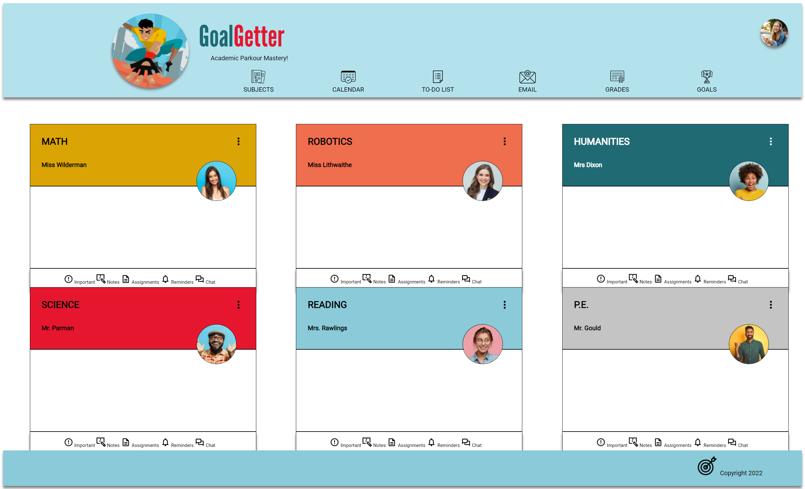
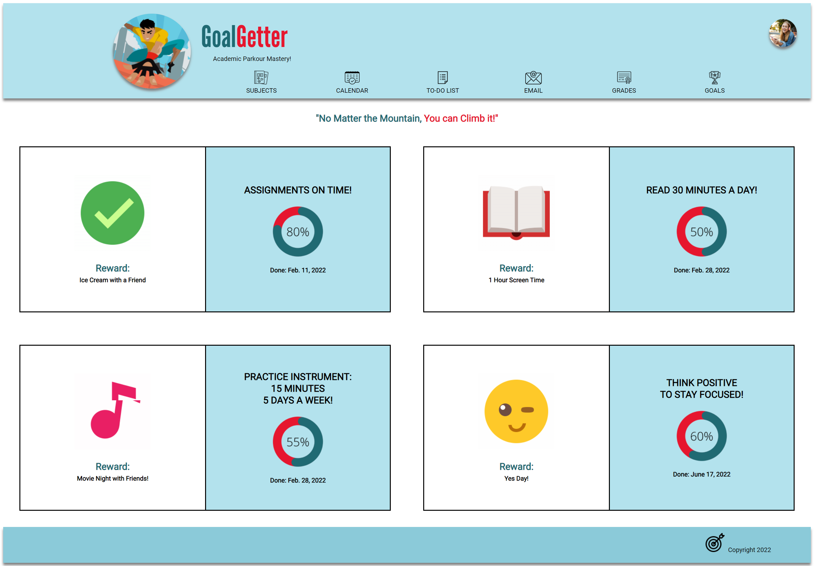

# GoalGetter
 Project 3 group 5 

## URL
[Deployed Project](https://jzsweet.github.io/p3-g5-goal-getters/)

## Authors
Kristi Bar, Jessica Waite, Jiaqian Zhao 

## Description
Keeping track of an ongoing list of homework assignments and class deadlines is overwhelming and confusing for middle school students, especially when homework is distributed both digitally and by hard copy. 
This results in students inadvertently turning in assignments late, receiving lower grades and becoming discouraged. 

A centralized digital place to organize their assignments that is simple and fun to use, could improve communication, grades, and motivation.

## Image
# Homepage
!(images/Goal Getter.png)

# Goals page

